# 基于 K-means 日志分析的攻击检测

翻译自 https://github.com/13o-bbr-bbq/machine_learning_security/blob/master/Security_and_MachineLearning/Chap4_AttackDetection.md

## 目的

本文的目的是通过日志分析系统的实现，来理解机器学习算法之一的**K平均法**。

## 4.1. 日志分析
日志分析是指对记录了用户对系统的操作和数据通信的历史记录等的日志进行分析，掌握可疑的操作和通信等的技术。除了安全以外，还有分析网页浏览记录，用于市场营销和商品宣传的案例。

日志分析的方法有很多，但是本博客使用**聚类**的方法进行日志分析。

| 聚类（Clustering） |
|:--------------------------|
| 从具有各种属性的数据混合在一起的数据组中，分别将具有相似性质的数据进行收集的技术。收集的数据称为**集群**。 |

通过对分析对象的日志进行聚集，可以将庞大的日志分成**正常数据的集群**、**异常(可能为不正当操作)数据的集群**等。这样一来，可以大幅度提高记录分析的工作效率。

以下展示典型的聚类方法。

 * 分层聚类  
 一种以树形结构输出聚集结果的方法。  
纵轴表示 Depth(=数据的相似度)，Depth 越小的数据表示与其他数据的相似度越低。  
下图为使用分层聚类的经典方法 **Ward 法**，对 [Iris flower dataset](https://en.wikipedia.org/wiki/Iris_flower_data_set) （包含 setosa, versicolor, virginica 三个品种的鸢尾花）进行聚类的结果。

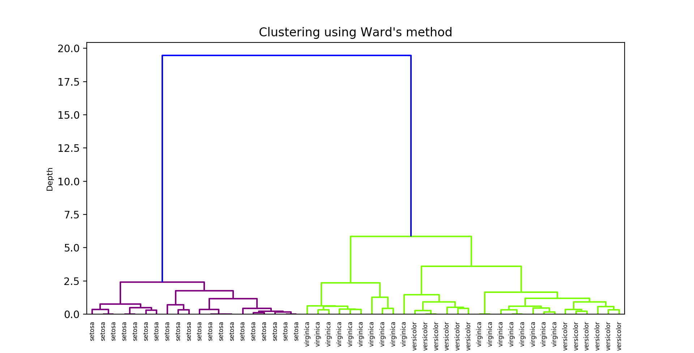  

紫色线所示的setosa与其他品种(versicolor, virginia)相比，其数据特征有很大的不同，因此可以看出其完全聚集(Depth 较小)。另一方面，黄绿色线所示的versicolor和virginica的数据特征相似，因此可以看出若干数据混合并聚集在一起(Depth 较大)。

 * 非分层聚类
 基于数据的特征量，创建**预先指定数量的集群**的方法。
下图为使用非分层聚集的代表性方法 **K平均法**（K-means），将 Iris flower dataset 定义为两个特征量：花瓣宽度（petal width）、花瓣长度（petal length）进行聚集的结果。

 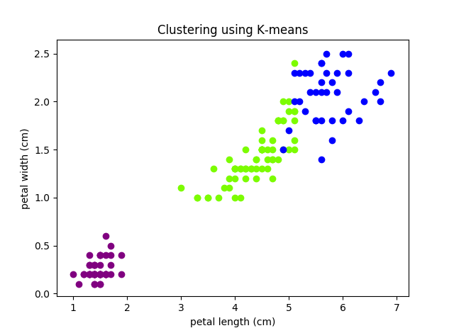  

紫色为 setosa、黄绿色为 versicolor、蓝色为 virginica。  

与Ward方法的结果相同，setosa与其他品种相比，数据的特征有很大的不同，因此可以看出它是被完全聚类的。另一方面，由于 versicolor 和 virginica 的数据特征相似，可见两个集群边界部分重叠。

像这样，通过进行聚类，可以自动对**庞大的数据进行分类**。

另外，聚类只能够对**数据进行自动分类**。在上面的图中，为了容易理解每个聚类方法，数据的种类 (setosa, virsicolor..) 被展示出来，但是实际上需要对聚类结果进行观察，才能判断每个集群显示的是什么数据。

### 4.1.1. 日志分析的概念
本例将**服务器的访问日志**进行聚类，从日志中寻找攻击的痕迹。

运行服务器中，不仅包含正常通信，还包含**攻击性的通信**(搜索行为和利用漏洞等)。如果不采取对策，对这样的通信放任不管的话，服务器可能会瘫痪或者被劫持，因此有必要在一定程度上确定攻击的有无和攻击的种类，然后采取适当的对策。

因此，在本文中，用**非分层聚类**来分析访问日志，寻找有无攻击和攻击的种类。然后，用 K-means 来实现。

## 4.2. K-means 入门
K平均法通过使用集群的平均值，创建预先给定的数量(K)的集群，来对数据进行自动分类。另外，在第1章到第3章中提到的机器学习算法是需要带标签数据的有监督学习，而K平均法属于不需要标签数据的无监督学习。  

| 无监督学习（Unsupervised Learning） |
|:--------------------------|
| 针对没有被赋予答案(标签)的数据组，寻找数据背后的结构(数据结构或规律等)的方法。 |

但是，如果没有监督数据，如何对数据进行自动分类呢?
下面用图来说明聚集的流程。
另外，在本例中 K=3，数据的维度设定为2维(特征量为2个)。  

 1. 将对象数据进行图示
 绘制想要聚类的数据。 
 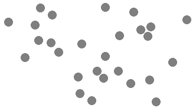  
  2. 确定中心点的初始值
     随机确定K个点。
     在本例中，“K=3”，因此选择3个中心点(m[0]， m[1]， m[2])。 
      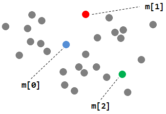  
  3. 创建初始集群
     对于中心点以外的各数据，确定离它距离最近的中心点。
     以三个中心点来确定三个集群。
     ※黑色实线表示集群边界。  
      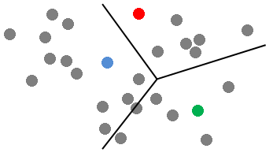  
  4. 更新中心点
      计算每个集群内数据的平均值，更新中心点。
      中心会像下面这样移动。
      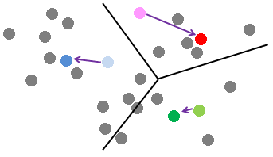 
  5. 重新创建集群
     以更新的中心点为中心重新创建集群。
     更新集群的边界如下所示。
     ※虚线表示旧集群边界，实线表示新集群边界。
     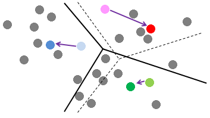
  6. 确认是否收敛
     确认是否满足收敛条件(※)。
     如果满足，则结束聚类(7)。
     如果不满足，重复4到5。
     ※收敛条件不是固定的，一般采用“集群的更新次数在阈值以上”“更新时的中心点的移动距离在阈值以下”等作为收敛条件。
  7. 完成聚类

     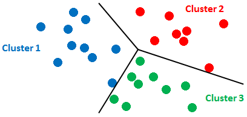 

像这样，反复进行**中心点的更新和集群重建**的简单计算，就可以对数据进行自动分类。

另外，在K平均法中，根据K的数量来决定簇数(=数据分类的类别数)，因此适当地设定**K是重要的**。此外，如上所述，K平均法只能对数据进行聚类，不能表示每个聚类的意义。因此，每个集群的意义需要人类进行分析和判断。

另外，在本例中，虽然使用了2维的数据，但是3维以上(3个以上的特征量)的数据也可以分类。

| 数据之间的距离（Distance） |
|:--------------------------|
| 使用欧几里得距离、余弦距离、马哈拉诺维斯距离等测量中心点与其他数据之间的距离。 |

至此，K平均法的入门就结束了。
下一节将解说使用K平均法的日志分析系统的构建步骤和实现代码。

## 4.3. 日志分析系统的实现
本文将构建具有以下功能的日志分析系统。

1. 可以将访问日志中的数据分类为多个集群
2. 可以可视化每个集群的成分

本系统将日志分类为确定好的数量(K)的集群。
然后，将**各集群中包含的数据的特征量(以下称为成分)图表化**，以便于日后分析的形式输出。

### 4.3.1. 准备分析对象的日志
准备分析对象的访问日志。

本来如果公司收集环境中使用了真实的数据通信的就好,但这里和[第1章的入侵检测](https://github.com/13o-bbr-bbq/machine_learning_security/blob/master/security_and_machinelearning/chap1_intrusiondetection.md)一样，使用 [kdd cup1999](http://kdd.ics.uci.edu/databases/kddcup99/kddcup99.html) 数据集。

从KDD Cup 1999下载 “kddcup.data_10_percent.gz”，将**42列的标签全部删除**。然后，为了缩短计算时间，将数据量削减到150左右。这样的话，就会变成以下的文件内容。

```
duration,protocol_type,service,flag,src_bytes,dst_bytes,land,wrong_fragment,urgent,hot,num_failed_logins,logged_in,num_compromised,root_shell,su_attempted,num_root,num_file_creations,num_shells,num_access_files,num_outbound_cmds,is_host_login,is_guest_login,count,srv_count,serror_rate,srv_serror_rate,rerror_rate,srv_rerror_rate,same_srv_rate,diff_srv_rate,srv_diff_host_rate,dst_host_count,dst_host_srv_count,dst_host_same_srv_rate,dst_host_diff_srv_rate,dst_host_same_src_port_rate,dst_host_srv_diff_host_rate,dst_host_serror_rate,dst_host_srv_serror_rate,dst_host_rerror_rate,dst_host_srv_rerror_rate
0,tcp,http,SF,181,5450,0,0,0,0,0,1,0,0,0,0,0,0,0,0,0,0,8,8,0,0,0,0,1,0,0,9,9,1,0,0.11,0,0,0,0,0
0,tcp,http,SF,239,486,0,0,0,0,0,1,0,0,0,0,0,0,0,0,0,0,8,8,0,0,0,0,1,0,0,19,19,1,0,0.05,0,0,0,0,0
0,tcp,http,SF,235,1337,0,0,0,0,0,1,0,0,0,0,0,0,0,0,0,0,8,8,0,0,0,0,1,0,0,29,29,1,0,0.03,0,0,0,0,0
0,tcp,http,SF,219,1337,0,0,0,0,0,1,0,0,0,0,0,0,0,0,0,0,6,6,0,0,0,0,1,0,0,39,39,1,0,0.03,0,0,0,0,0
0,tcp,http,SF,217,2032,0,0,0,0,0,1,0,0,0,0,0,0,0,0,0,0,6,6,0,0,0,0,1,0,0,49,49,1,0,0.02,0,0,0,0,0
0,tcp,http,SF,217,2032,0,0,0,0,0,1,0,0,0,0,0,0,0,0,0,0,6,6,0,0,0,0,1,0,0,59,59,1,0,0.02,0,0,0,0,0
0,tcp,http,SF,212,1940,0,0,0,0,0,1,0,0,0,0,0,0,0,0,0,0,1,2,0,0,0,0,1,0,1,1,69,1,0,1,0.04,0,0,0,0

...snip...

162,tcp,telnet,SF,1567,2738,0,0,0,3,0,1,4,1,0,0,1,0,0,0,0,0,1,1,0,0,0,0,1,0,0,4,4,1,0,0.25,0,0,0,0,0
127,tcp,telnet,SF,1567,2736,0,0,0,1,0,1,0,0,0,0,1,0,0,0,0,0,83,1,0.99,0,0,0,0.01,0.08,0,5,5,1,0,0.2,0,0,0,0,0
321,tcp,telnet,RSTO,1506,1887,0,0,0,0,0,1,0,0,0,0,1,0,0,0,0,0,151,1,0.99,0,0.01,1,0.01,0.06,0,6,6,1,0,0.17,0,0,0,0.17,0.17
45,tcp,telnet,SF,2336,4201,0,0,0,3,0,1,1,1,0,0,0,0,0,0,0,0,2,1,0,0,0.5,0,0.5,1,0,7,7,1,0,0.14,0,0,0,0.14,0.14
176,tcp,telnet,SF,1559,2732,0,0,0,3,0,1,4,1,0,0,1,0,0,0,0,0,1,1,0,0,0,0,1,0,0,8,8,1,0,0.12,0,0,0,0.12,0.12
61,tcp,telnet,SF,2336,4194,0,0,0,3,0,1,1,1,0,0,0,0,0,0,0,0,1,1,0,0,0,0,1,0,0,9,9,1,0,0.11,0,0,0,0.11,0.11
47,tcp,telnet,SF,2402,3816,0,0,0,3,0,1,2,1,0,0,0,0,0,0,0,0,1,1,0,0,0,0,1,0,0,10,10,1,0,0.1,0,0,0,0.1,0.1
```

在本文件中，每行表示一个通信记录，列表示构成记录的成分。例如，`duration`表示与主机的连接时间，`dst_host_serror_rate`表示SYN错误率。

※各特征量的细节参照[这里](http://kdd.ics.uci.edu/databases/kddcup99/task.html)。

这个文件保存为[kddcup.data small.csv](https://github.com/13o-bbr-bbq/machine_learning_security/blob/master/security_and_machinelearning/dataset/kddcup.data_small.csv)。

### 4.3.2. 确定集群数
对于普通人来说，通过目视数据来确定适当的簇数是不可能的，所以需要通过某种方法来确定簇数。
添加目标的方法有很多，这次使用被称为**轮廓分析**的方法。

| 轮廓分析（Silhouette Analysis） |
|:--------------------------|
| 将集群内的样本密度(凝聚度)可视化，并且在**集群之间的距离足够远的情况下视为最佳集群的数目**。 |

以下是将聚类数设定为“5”进行轮廓分析的例子。

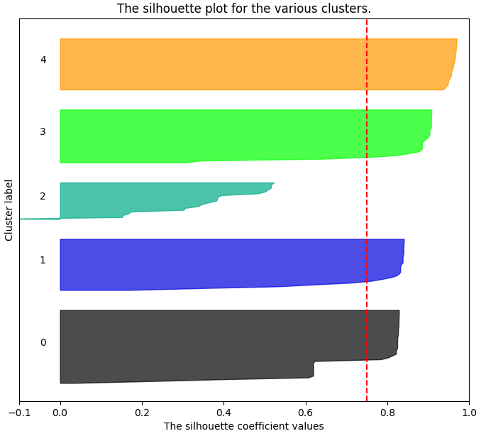

横轴`The silhouette coefficient values`表示**数据远离邻近集群的程度**。
每个集群被分割得越好，该值就越接近1(因为如果集群的数目适当，每个集群中包含的数据就会在一定程度上偏离)。

纵轴的`Cluster label`表示**各集群的标签**。
在每个集群标签旁边画的**轮廓的宽度表示集群的数据的数目**，假设想要分割的各种类型的数据的数目相同，则宽度几乎相同。

轮廓分析可以使用 scikit-learn 简单地实现，所以在本文中不做代码解说。想了解详细代码的人请参考[这里](http://scikit-learn.org/stable/auto_examples/cluster/plot_kmeans_silhouette_analysis.html)。

#### 4.3.2.1. 轮廓分析的执行结果
为了在轮廓分析中找到合适的集群数，要一边一个一个地增加集群数，一边观察每个集群的 `The silhouette coefficient values` 和轮廓宽度是否合适。
以下是对这次的分析对象的日志 “kddcup.data_small.csv” 一边将集群数改变为2 ~ 6一边执行的结果。

 * 集群数 = 2  
 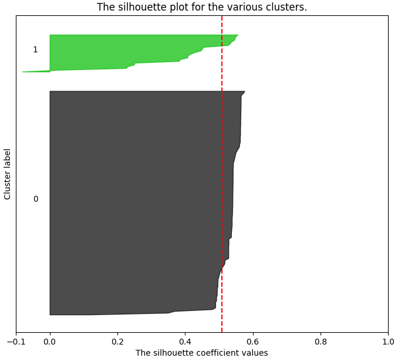  

`Silhouette coefficient`远离1，轮廓的宽度也有很大的差别。
因此，将集群数设为2是不合适的。

 * 集群数=3  
 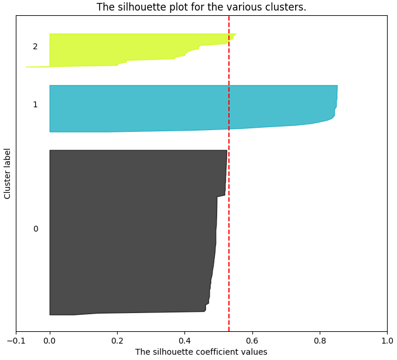  

cluster1的`Silhouette coefficient`近似于1，但是cluster0、2远离。另外，轮廓的宽度也有很大的差别。
因此，将集群数设为3也是不合适的。

 * 集群数=4  
 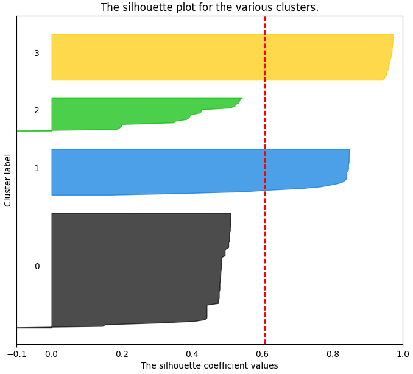  

变成了比较好的形状。
但是，因为cluster0的轮廓宽度过大，所以似乎可以再进行集群分割。 

 * 集群数=5  
   

4个集群的`Silhouette coefficient`近似为1，轮廓的宽度也基本均等了。
这是到目前为止最好的形状。因此，将集群数设为5比较合适。

 * 集群数=6  
 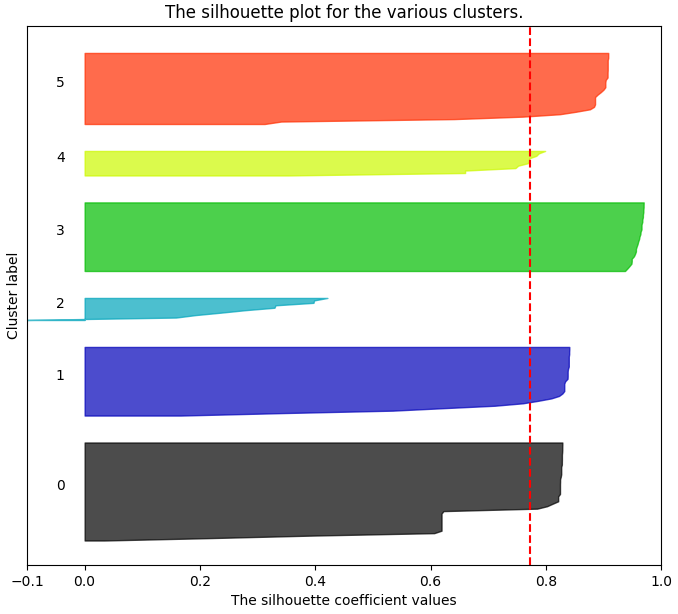  

以防万一，试着将集群数设为6。
`Silhouette coefficient`的变化很少，但是cluster2大大远离了1。
另外，由于cluster2、4的轮廓宽度变得极端小，我们认为集群被过度分割了。
因此，将集群数设为6是不合适的。

从结果中可以看出，在集群数为5的情况下，剪影的宽度基本均等，`Silhouette Coefficient`也最接近于1。因此，这次将**集群数设为5**来执行集群的话会有好的结果。

这样一来，分析对象日志的准备和集群数就做好了。
在下一节中，将实际执行示例代码，以验证分析对象日志是否能够正确地聚类。

### 4.3.3. 示例代码和执行结果
#### 4.3.3.1. 示例代码

本博客使用Python3，安装了简易的日志分析系统。
※本代码[这里](可以从https://github.com/13o-bbr-bbq/machine_learning_security/blob/master/security_and_machinelearning/src/k-means.py)得到。

本系统的大致处理流程如下所示。

1. 分析对象日志的加载
2. 基于K平均法的聚类
3. 分析结果的可视化

```
# -*- coding: utf-8 -*-
import os
import pandas as pd
import numpy as np
import matplotlib.pyplot as plt
from sklearn.cluster import KMeans

# Cluster number using k-means.
CLUSTER_NUM = 5

# Dataset path.
dataset_dir = os.path.join(os.path.dirname(os.path.abspath(__file__)), '../dataset')
dataset_path = os.path.join(dataset_dir, 'kddcup.data_small.csv')

# Load data.
df_kddcup = pd.read_csv(dataset_path)
df_kddcup = df_kddcup.iloc[:, [0, 7, 10, 11, 13, 35, 37, 39]]

# Normalization.
df_kddcup = (df_kddcup - df_kddcup.mean()) / df_kddcup.std()

# Transpose of matrix.
kddcup_array = np.array([df_kddcup['duration'].tolist(),
                      df_kddcup['wrong_fragment'].tolist(),
                      df_kddcup['num_failed_logins'].tolist(),
                      df_kddcup['logged_in'].tolist(),
                      df_kddcup['root_shell'].tolist(),
                      df_kddcup['dst_host_same_src_port_rate'].tolist(),
                      df_kddcup['dst_host_serror_rate'].tolist(),
                      df_kddcup['dst_host_rerror_rate'].tolist(),
                      ], np.float)
kddcup_array = kddcup_array.T

# Clustering.
pred = KMeans(n_clusters=CLUSTER_NUM).fit_predict(kddcup_array)
df_kddcup['cluster_id'] = pred
print(df_kddcup)
print(df_kddcup['cluster_id'].value_counts())

# Visualization using matplotlib.
cluster_info = pd.DataFrame()
for i in range(CLUSTER_NUM):
    cluster_info['cluster' + str(i)] = df_kddcup[df_kddcup['cluster_id'] == i].mean()
cluster_info = cluster_info.drop('cluster_id')
kdd_plot = cluster_info.T.plot(kind='bar', stacked=True, title="Mean Value of Clusters")
kdd_plot.set_xticklabels(kdd_plot.xaxis.get_majorticklabels(), rotation=0)

print('finish!!')
```

#### 4.3.3.2. 代码解释
这次在K平均法的实现中，使用了机器学习库**scikit-learn**。
※scikit-learn的使用方法参照[官方文档](http://scikit-learn.org/)。

##### 导入包
```
import matplotlib.pyplot as plt
from sklearn.cluster import KMeans
```

导入scikit-learn的K平均法包“`KMeans`”。
这个包中收录了进行K平均法的各种各样的类。

另外，为了使聚集结果可视化，图表绘制包“`matplotlib`”也一并导入。

##### 设置集群数
```
CLUSTER_NUM = 5
```

如上一节所述，集群数设定为5。

##### 加载分析对象数据
```
# Dataset path.
dataset_dir = os.path.join(os.path.dirname(os.path.abspath(__file__)), '../dataset')
dataset_path = os.path.join(dataset_dir, 'kddcup.data_small.csv')

# Load data.
df_kddcup = pd.read_csv(dataset_path)
df_kddcup = df_kddcup.iloc[:, [0, 7, 10, 11, 13, 35, 37, 39]]

# Normalization.
df_kddcup = (df_kddcup - df_kddcup.mean()) / df_kddcup.mean()
```

加载分析对象日志“kddcup.data_small.csv”来获取数据。分析使用的特征量和[第1章的入侵检测](https://github.com/13o-bbr-bbq/machine_learning_security/blob/master/security_and_machinelearning/chap1_intrusiondetection.md)一样使用以下的8个(`df_kddcup = df_kddcup.iloc[:, [0, 7, 10, 11, 13, 35, 37, 39]]`

| Feature | Description |
|:------------|:------------|
| dst_host_serror_rate | SYN错误率。 |
| dst_host_same_src_port_rate | 对同一端口的接通率。 |
| wrong_fragment | 有错误的fragment数。 |
| duration | 到主机的连接时间(秒)。 |
| logged_in | 是否登录成功           |
| root_shell | 是否取得 root shell。 |
| dst_host_rerror_rate | REJ 错误率。 |
| num_failed_logins | 尝试登录的失败次数 |

また、分析精度を上げるために、各特徴量のデータ値を正規化します（`df_kddcup = (df_kddcup - df_kddcup.mean()) / df_kddcup.mean()`）。  

另外，为了提高分析精度，将各特征量的数据值归一化(`df_kddcup = (df_kddcup - df_kddcup.mean()) / df_kddcup.mean()`)。

##### 数据行列变换
```
kddcup_array = np.array([df_kddcup['duration'].tolist(),
                      df_kddcup['wrong_fragment'].tolist(),
                      df_kddcup['num_failed_logins'].tolist(),
                      df_kddcup['logged_in'].tolist(),
                      df_kddcup['root_shell'].tolist(),
                      df_kddcup['dst_host_same_src_port_rate'].tolist(),
                      df_kddcup['dst_host_serror_rate'].tolist(),
                      df_kddcup['dst_host_rerror_rate'].tolist(),
                      ], np.float)
kddcup_array = kddcup_array.T
```

为了获取参数`matrix`，以用于后面描述的用于执行聚类的方法`fit_predict`，这里将读入的数据转换成`numpy`的矩阵。

##### 执行聚类
```
pred = KMeans(n_clusters=CLUSTER_NUM).fit_predict(kddcup_array)
```

用scikit-learn的K平均法类 `KMeans(n_clusters=CLUSTER_NUM)` 创建K平均法模型，将集群数 `n_clusters` 指定为创建本模型时的参数 `CLUSTER_NUM`。

然后，通过向`KMeans`的方法`fit_predict`传递矩阵变换后的分析对象日志，执行聚类。

##### 聚类结果可视化
```
cluster_info = pd.DataFrame()
for i in range(CLUSTER_NUM):
    cluster_info['cluster' + str(i)] = df_kddcup[df_kddcup['cluster_id'] == i].mean()
cluster_info = cluster_info.drop('cluster_id')
kdd_plot = cluster_info.T.plot(kind='bar', stacked=True, title="Mean Value of Clusters")
kdd_plot.set_xticklabels(kdd_plot.xaxis.get_majorticklabels(), rotation=0)
```

将聚类结果用`matplotlib`的**堆柱状图**输出。

#### 4.3.3.3. 执行结果
```
python k-means.py
```

执行结果如下图

 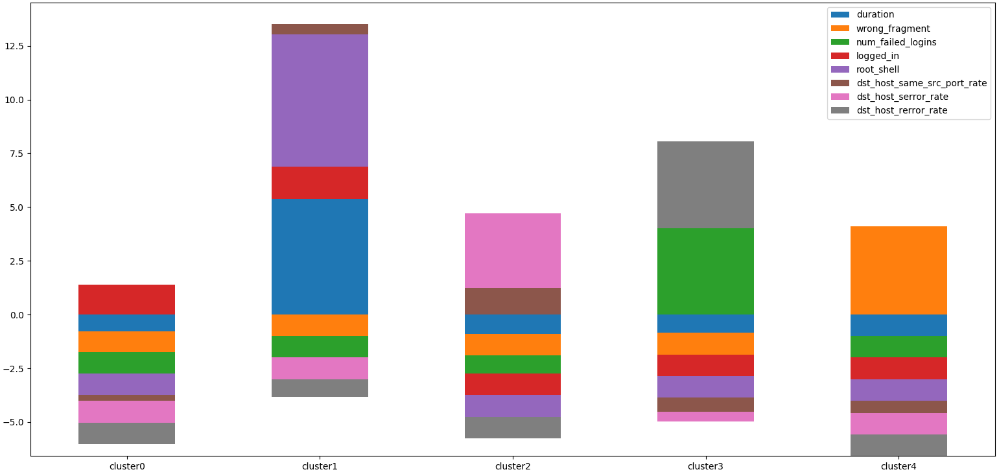

从图表中可以看出，**5个集群被创建**，**每个集群中包含的数据的成分被用颜色表示**。那么，让我们一边逐一观察各个集群的成分，一边推测各个集群代表什么吧。

 * cluster1
 
可以看出` root_shell `(是否取得root shell)和`duration`(与主机的连接时间)的分量比其他集群大。
根据“连接主机的时间长”“被赋予root权限的情况多”等特征，推测是**缓冲区溢出**的集群。
 
 * cluster2 
 
`dst_host_serror_rate` (SYN错误率)和`dst_host_same_src_port_rate`(对同一端口的连接率)的分量比其他集群大。
根据“SYN错误率高”“对同一端口的连接比例多”的特征，推测是通过**Nmap扫描端口**或**SYN Flood 攻击**的集群。
 
 * cluster3 
 
可以看出`dst_host_rerror_rate` (REJ错误率)和`num_failed_logins`(登录尝试的失败次数)的分量比其他集群大。
根据“REJ错误率高”“登录尝试的失败次数多”的特征，推测是**密码猜测**的集群。
 
 * cluster4  
 
`wrong_fragment`(有错误的分片数) 比其他集群大。
根据“有错误的片段”多的特征，推测是**Teardrop**的集群。
 
 * cluster0   
 
成分没有太大的偏差。
 因此，推测是**正常通信**的集群。

这次的分析对象日志“`kddcup.data_small.csv`”用K平均法分析的结果，明白了有受到4种攻击(Buffer Overflow, Nmap/SYN Flood, Guess Password, Teardrop)的可能性。

## 4.4. 结尾
通过使用集群分析日志，可以推测出服务器受到**4种攻击的可能性**。再以这个分析结果为基础，进行“日志的进一步挖掘”和“同一时间被记录的其他日志的详细分析”，**确定攻击的种类**，也许能采取适当的对策。

像这样，K平均法容易实现，处理速度也快，如果有兴趣的话，推荐大家在身边的各种任务中使用。 

## 4.5. 运行环境
 * Python 3.6.1
 * matplotlib 2.0.2
 * numpy 1.13.3
 * pandas 0.20.3
 * scikit-learn 0.19.0
